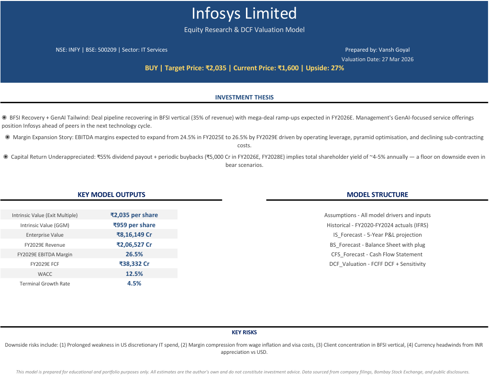

# 📊 Infosys Limited — Equity Research & DCF Valuation Model

> A comprehensive, fully-integrated financial model for **Infosys Limited (NSE: INFY | BSE: 500209)**,
> covering historical analysis, 3-statement forecasting, DCF valuation, comparable company
> analysis, credit metrics, and sentiment research.

---
## 📸 Preview

.png)

---

## 📁 File

| File | Description |
|------|-------------|
| `Model.xlsx` | Full equity research & valuation model (11 sheets) |

---

## 🗂️ Model Structure

| Sheet | Description |
|-------|-------------|
| `Cover` | Title page with ticker info and valuation date |
| `Assumptions` | Central hub for all model drivers and growth inputs |
| `Scenarios` | Bear / Base / Bull case toggle for sensitivity analysis |
| `Historical` | Infosys financials from FY2020–FY2024 (IFRS Consolidated) |
| `IS_Forecast` | Projected Income Statement: FY2025E–FY2029E |
| `BS_Forecast` | Projected Balance Sheet: FY2025E–FY2029E |
| `CFS_Forecast` | Projected Cash Flow Statement: FY2025E–FY2029E |
| `DCF_Valuation` | FCFF-based DCF with WACC and terminal value |
| `Comps` | Comparable company analysis across IT Services peers |
| `Credit_Metrics` | Liquidity, leverage, and coverage ratios dashboard |
| `Sentiment` | Qualitative research — management tone & analyst sentiment |

---

## 🔍 Key Features

- ✅ **Fully Integrated 3-Statement Model** — IS, BS, and CFS linked dynamically
- ✅ **DCF Valuation** — FCFF approach with WACC build-up and terminal value
- ✅ **3-Scenario Analysis** — Instantly toggle between Bear, Base, and Bull cases
- ✅ **Comparable Company Analysis** — EV/Revenue, EV/EBITDA, P/E across IT peers
- ✅ **Credit Metrics Dashboard** — Liquidity, leverage & coverage ratios (FY2024A–FY2029E)
- ✅ **Sentiment Tracker** — Earnings call scoring and management tone analysis
- ✅ **Dynamic Assumptions Sheet** — All drivers centralised for easy scenario testing

---

## 📈 Company Overview

| Detail | Info |
|--------|------|
| **Company** | Infosys Limited |
| **Ticker** | NSE: INFY \| BSE: 500209 |
| **Sector** | IT Services |
| **Reporting Currency** | ₹ Crores (IFRS Consolidated) |
| **Historical Period** | FY2020 – FY2024 |
| **Forecast Period** | FY2025E – FY2029E |
| **Market Data** | As of March 2026 |

---

## 🛠️ Tools Used

- **Microsoft Excel** — Financial modelling, scenario analysis, dashboards
- **Sources** — NSE/BSE filings, earnings transcripts, Bloomberg, company press releases

---

## 👤 Author

**Vansh Goyal**
- 📧 [vggoyal2304@gmail.com]
- 💼 [LinkedIn URL]

---

## ⚠️ Disclaimer

> This model is built purely for **educational and analytical purposes**.
> It does not constitute financial advice or a recommendation to buy or sell any security.
> All forecasts are based on publicly available information and independent assumptions.
